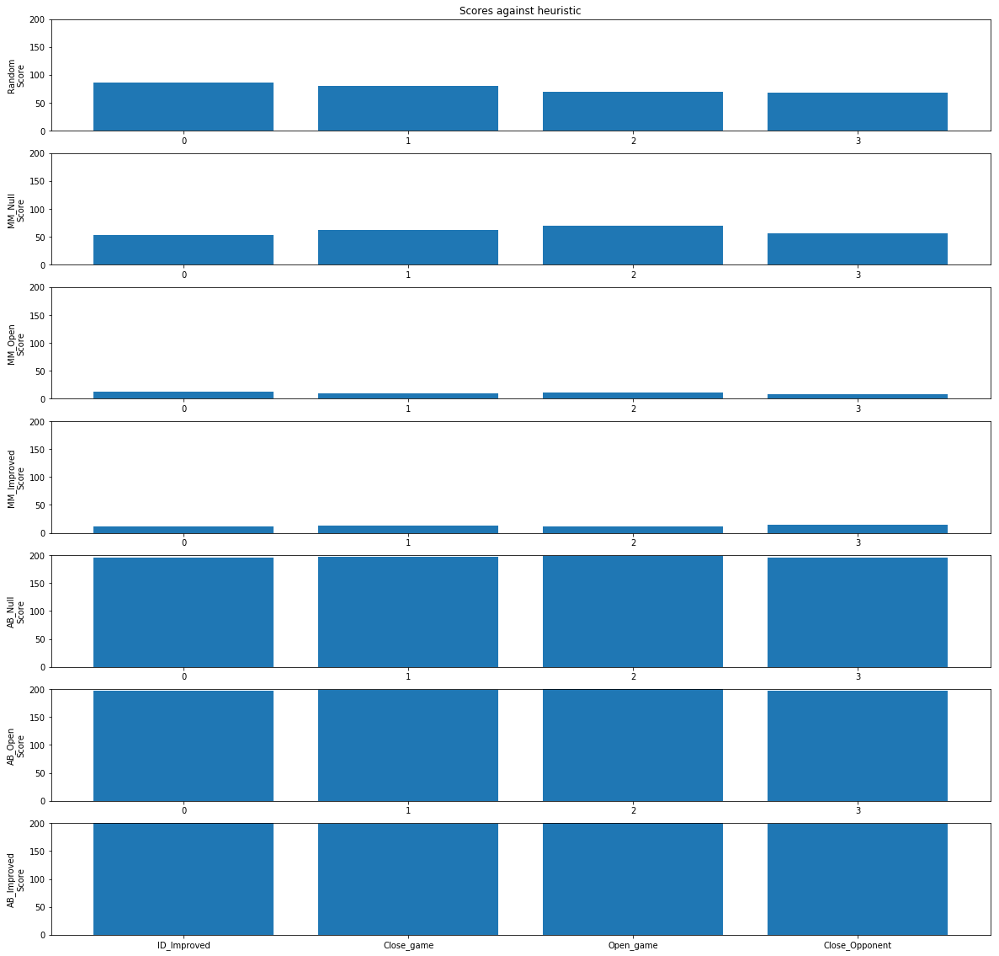
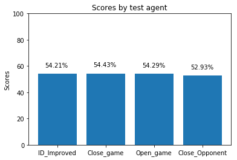

---
output:
  pdf_document: default
  html_document: default
---

# 1. Synopsis

Implement three custom heuristic functions and evaluate their performance using the tournament.py script included in the AIND-Isolation project against the improved heuristic discussed in the lectures.

The questions to be asked:

    Which heuristic do you think goes much deeper?
    How easy is your heuristic ?
    Which of your heuristics performs better and why?

1. Are the customs heuristics better than the improved heuristic?
2. Which heuristc performs best?
3. Which search method performs best?

## 1.2 Improved score

The "Improved" evaluation function discussed in lecture that outputs a score equal to the difference in the number of moves available to the two players.

own_moves = len(game.get_legal_moves(player))

opp_moves = len(game.get_legal_moves(game.get_opponent(player)))

score = own_moves - opp_moves

# 2. Custom heuristic functions

## 2.1 Close game

Objective:
This heuristic assumes closing the opponent options and keeping a closed game (less total options) increases the player options to win the game.


score = (own_moves - n * opp_moves)

## 2.2 Open game

Objective:
This heuristic assumes that closing the opponent options and keeping an open game (more total options) increases the player options to win the game.


score = (own_moves - opp_moves) / (own_moves + opp_moves)

## 2.3 Close opponent

Objective:
This heuristic assumes that closing the options of the opponent increases the player options to win the game.


n = 4

score = (own_moves - n * opp_moves)

# 3. Results


```python
import numpy as np
import matplotlib.pyplot as plt
```


```python
import tournament
tournament.main()
```


    This script evaluates the performance of the custom heuristic function by
    comparing the strength of an agent using iterative deepening (ID) search with
    alpha-beta pruning against the strength rating of agents using other heuristic
    functions.  The `ID_Improved` agent provides a baseline by measuring the
    performance of a basic agent using Iterative Deepening and the "improved"
    heuristic (from lecture) on your hardware.  The `Student` agent then measures
    the performance of Iterative Deepening and the custom heuristic against the
    same opponents.


    *************************
     Evaluating: ID_Improved
    *************************

    Playing Matches:
    ----------
      Match 1: ID_Improved vs   Random    	Result: 86 to 114
      Match 2: ID_Improved vs   MM_Null   	Result: 54 to 146
      Match 3: ID_Improved vs   MM_Open   	Result: 13 to 187
      Match 4: ID_Improved vs MM_Improved 	Result: 12 to 188
      Match 5: ID_Improved vs   AB_Null   	Result: 196 to 4
      Match 6: ID_Improved vs   AB_Open   	Result: 198 to 2
      Match 7: ID_Improved vs AB_Improved 	Result: 200 to 0


    Results:
    ----------
    ID_Improved         54.21%

    *************************
    Evaluating: Student close_game_score
    *************************

    Playing Matches:
    ----------
      Match 1: Student close_game_score vs   Random    	Result: 81 to 119
      Match 2: Student close_game_score vs   MM_Null   	Result: 63 to 137
      Match 3: Student close_game_score vs   MM_Open   	Result: 10 to 190
      Match 4: Student close_game_score vs MM_Improved 	Result: 13 to 187
      Match 5: Student close_game_score vs   AB_Null   	Result: 197 to 3
      Match 6: Student close_game_score vs   AB_Open   	Result: 199 to 1
      Match 7: Student close_game_score vs AB_Improved 	Result: 199 to 1


    Results:
    ----------
    Student close_game_score     54.43%

    *************************
    Evaluating: Student open_game_score
    *************************

    Playing Matches:
    ----------
      Match 1: Student open_game_score vs   Random    	Result: 70 to 130
      Match 2: Student open_game_score vs   MM_Null   	Result: 70 to 130
      Match 3: Student open_game_score vs   MM_Open   	Result: 11 to 189
      Match 4: Student open_game_score vs MM_Improved 	Result: 11 to 189
      Match 5: Student open_game_score vs   AB_Null   	Result: 198 to 2
      Match 6: Student open_game_score vs   AB_Open   	Result: 200 to 0
      Match 7: Student open_game_score vs AB_Improved 	Result: 200 to 0


    Results:
    ----------
    Student open_game_score     54.29%

    *************************
    Evaluating: Student close_opponent_score
    *************************

    Playing Matches:
    ----------
      Match 1: Student close_opponent_score vs   Random    	Result: 69 to 131
      Match 2: Student close_opponent_score vs   MM_Null   	Result: 57 to 143
      Match 3: Student close_opponent_score vs   MM_Open   	Result: 9 to 191
      Match 4: Student close_opponent_score vs MM_Improved 	Result: 14 to 186
      Match 5: Student close_opponent_score vs   AB_Null   	Result: 195 to 5
      Match 6: Student close_opponent_score vs   AB_Open   	Result: 198 to 2
      Match 7: Student close_opponent_score vs AB_Improved 	Result: 199 to 1


    Results:
    ----------
    Student close_opponent_score     52.93%


# 4. Figures

## 4.1 Scores against fixed agents


```python
import plot_scores
plot_scores.main()
```




## 4.2 Scores by test agent



\pagebreak

# 5. Conclusions

## 5.1 Are the customs heuristics better than the improved heuristic?

There is not a big difference between the ID_Improved heuristic and the custom (Student) heuristics.

## 5.2 Which heuristc performs best?

The open game heuristic (See 2.2) performs best and is therefore my choice.

## 5.3 Which search method performs best?

There is a bigger difference between the minimax and the alpha-beta results. This could be because of the nature of the tests, where the starting point is a random position. In a complete game it is expected that iterative search with alpha-beta against minimax could produce better results.
